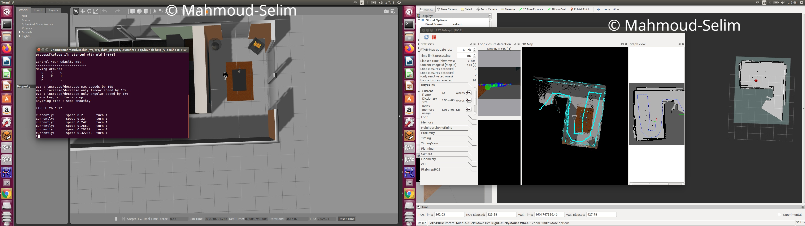

# RoboND-SLAM-Project

 This project studies Simultaneous Localization and Mapping (SLAM) problem using Real-Time Appearance-Based Mapping (RTAB-Map) in a Gazebo environment. A robot model from the previous localization project was used with an added RGB-D camera to map both predefined and custom made environment. With data from robot sensors and odometry data, using RTAB-Map ROS library database of environments were built, and both 2D and 3D maps were generated. The project was tested on ubuntu 16.04 and ros kinetic. Please refer to [project writeup](https://https://github.com/Mahmoud-Selim/RoboND-SLAM-Project/blob/master/slam_writeup.pdf) for more information.

## Dependencies Installation
To install the depencies for the project, you only need to install the rtabmap. everything else is present in packages in the repository.

To install the rtabmap run the following in a terminal (Debian based)

```sh
sudo apt-get install ros-kinetic-rtabmap-ros
```

## Building the workspace
Create catkin workspace, if you haven't already.For this project catkin_ws is used, if your workspace name is different, change the commands accordingly. 

```sh
$ mkdir -p ~/catkin_ws/src
$ cd ~/catkin_ws/src
$ catkin_init_workspace
$ cd ~/catkin_ws
$ catkin_make
```
Clone the repo in your home directory:
```sh
$ git clone https://github.com/Mahmoud-Selim/RoboND-SLAM-Project.git
```
Copy the content of this repo to your catkin_ws/src folder, source and build the project:
```sh
$ cd ~/catkin_ws
$ catkin_make
$ source devel/setup.bash
```
To run the mapping process open up 4 terminals and run following commands seperately:
```sh
$ cd ~/catkin_ws
$ source devel/setup.bash
$ roslaunch slam_project world.launch
$ roslaunch slam_project teleop.launch
$ roslaunch slam_project mapping.launch
$ roslaunch slam_project rviz.launch
```
Then on the terminal that run teleop.launch move robot around the map using keyboard to map the world



To change the world environment edit `world_file` parameter in world.launch file
```
<include file="$(find gazebo_ros)/launch/empty_world.launch">
  	<!-- <arg name="world_file" value="$(find slam_project)/worlds/kitchen_dining.world"/>-->
    <arg name="world_name" value="$(find slam_project)/worlds/myworld.world"/>
    <arg name="paused" value="$(arg paused)"/>
```
or more conveniently, pass the world_file parameter to your world launch file as follows:
```sh
$ roslaunch slam_project world.launch world_file:=~/catkin_ws/src/slam_project/worlds/kitchen_dining.world
```
